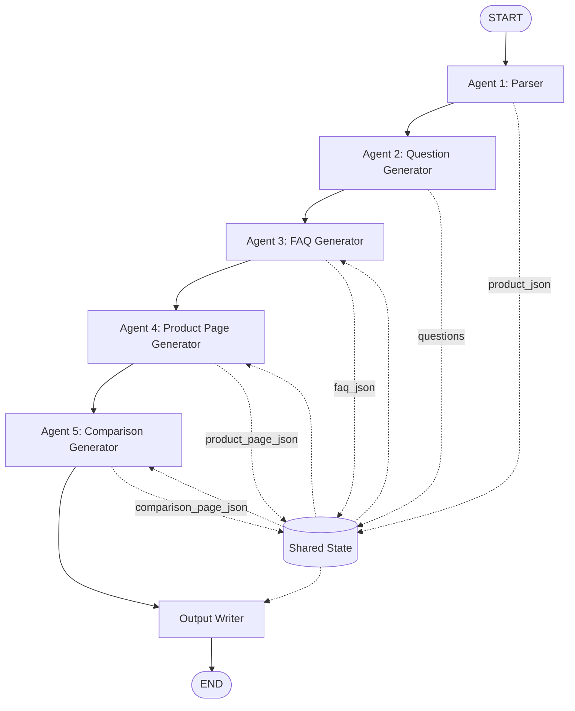
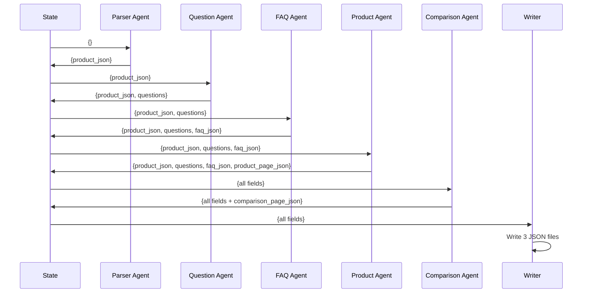

# Kasparro – Agentic Content Generation System
## Technical Documentation

**Author:** Deepesh Sherawat  
**Date:** December 2025  
**Framework:** LangGraph + LangChain + Ollama

---

## 1. Problem Statement

Design and implement a **modular agentic automation system** that:

1. Accepts a single structured product dataset as input
2. Automatically generates 15+ categorized user questions
3. Produces three complete, machine-readable JSON pages:
   - FAQ Page (minimum 5 Q&A pairs)
   - Product Description Page
   - Product Comparison Page (vs fictional Product B)
4. Uses **multi-agent architecture** (not a monolithic script)
5. Leverages **LLM reasoning** with **deterministic logic blocks**
6. Ensures all content derives **only from provided data** (no external knowledge)

---

## 2. Solution Overview

This system implements a **true multi-agent pipeline** using:

- **LangGraph StateGraph** for agent orchestration
- **LangChain** for tool integration and LLM interaction
- **Ollama** (llama3.1) for local LLM inference
- **5 specialized agents** with clear responsibilities
- **Deterministic content logic blocks** for data transformation
- **Guaranteed output compliance** (15+ questions, 3 pages, valid JSON)

### Key Architectural Decisions

1. **State Machine over Sequential Scripts**  
   Uses LangGraph's StateGraph for proper agent orchestration

2. **Tool-Based Data Access**  
   LangChain `@tool` decorators ensure type-safe product data access

3. **Deterministic Fallbacks**  
   Guarantees requirements even if LLM fails (e.g., 15 hardcoded questions)

4. **Single Source of Truth**  
   All answers derive from `product_input.json` - zero hallucinations

5. **Clear Agent Boundaries**  
   Each agent is a pure function: `(state) -> updated_state`

---

## 3. Scopes & Assumptions

### In Scope

✅ Single product input (`product_input.json`)  
✅ Fictional Product B for comparison  
✅ LLM-powered question generation  
✅ Deterministic answer generation  
✅ 3 JSON output files  
✅ Minimum 15 categorized questions  
✅ Error handling and validation  
✅ Local LLM execution (no API costs)

### Out of Scope

❌ Multi-product batch processing  
❌ External data sources or web scraping  
❌ UI/frontend implementation  
❌ Database storage  
❌ API endpoints  
❌ Real-time updates  
❌ User authentication

### Assumptions

- Input data is well-formed JSON
- Ollama server is running locally
- llama3.1 model is downloaded
- System has sufficient memory for LLM inference
- Product data fits within context window

---

## 4. System Design

### 4.1 High-Level Architecture



### 4.2 State Schema

The system uses a **TypedDict** to define shared state across all agents:

```python
class AgentState(TypedDict, total=False):
    """
    Shared state that flows through the agent pipeline.
    'total=False' makes all fields optional for LangGraph compatibility.
    """
    product_json: str              # Serialized Product object
    questions: list                # List of categorized questions
    faq_json: dict                 # Complete FAQ page structure
    product_page_json: dict        # Complete product page structure
    comparison_page_json: dict     # Complete comparison page structure
```

### 4.3 Agent Responsibilities

| Agent | Input | Output | Purpose |
|-------|-------|--------|---------|
| **Parser Agent** | None (reads file) | `product_json` | Validates and parses `product_input.json` into Product model |
| **Question Generator** | `product_json` | `questions` | Generates 15+ categorized questions using LLM (with fallback) |
| **FAQ Page Agent** | `product_json`, `questions` | `faq_json` | Answers all questions using only product data |
| **Product Page Agent** | `product_json` | `product_page_json` | Builds structured product description page |
| **Comparison Agent** | `product_json` | `comparison_page_json` | Loads Product B, generates comparison table |
| **Output Writer** | All fields | None | Writes 3 JSON files to disk |

### 4.4 Data Flow Diagram



---

## 5. Detailed Agent Design

### 5.1 Agent 1: Product Parser

**Purpose:** Validate and parse input JSON

**Implementation:**
```python
def product_parser_agent(state: AgentState) -> dict:
    parser = ProductParserAgent()
    product = parser.run()  # Returns Product dataclass
    return {"product_json": json.dumps(product.__dict__)}
```

**Key Features:**
- Validates all required fields exist
- Provides clear error messages if data is malformed
- Uses `dataclass` for type safety
- Returns serialized JSON string for state

### 5.2 Agent 2: Question Generator

**Purpose:** Generate 15+ categorized questions

**Strategy:**
1. **Primary:** Ask LLM to generate 3 questions × 5 categories = 15 total
2. **Fallback:** Use hardcoded question templates if LLM fails

**Categories:**
- Informational (What is this product?)
- Usage (How do I use it?)
- Safety (Are there side effects?)
- Purchase (How much does it cost?)
- Comparison (How does it compare?)

**Key Features:**
- Explicit prompt: "Generate EXACTLY 15 questions"
- JSON extraction handles markdown code fences
- Guaranteed 15 questions via fallback
- Each question ends with `?`

### 5.3 Agent 3: FAQ Generator

**Purpose:** Answer all questions using only product data

**Implementation:**
```python
def _answer_from_product_data(question: str, product: dict) -> str:
    """Rule-based answering using keyword matching"""
    if "price" in question.lower():
        return f"The product is priced at ₹{product['price']}."
    # ... more rules
```

**Key Features:**
- Zero external knowledge
- Keyword-based question routing
- Guaranteed answers for all questions
- Groups answers by category

### 5.4 Agent 4: Product Page Generator

**Purpose:** Build structured product description

**Uses:** `ContentLogicBlocks` class for reusable content generation

**Generated Sections:**
- Headline and tagline
- Hero section (main benefit, price)
- Key features
- Ingredients list
- Usage instructions
- Safety information
- Target audience

### 5.5 Agent 5: Comparison Page Generator

**Purpose:** Compare Product A vs fictional Product B

**Implementation:**
1. Load `product_b.json` (fictional competitor)
2. Use `ContentLogicBlocks.generate_comparison_points()`
3. Create side-by-side comparison table
4. Generate recommendations

**Comparison Aspects:**
- Concentration
- Skin type compatibility
- Ingredients
- Benefits
- Price

---

## 6. Reusable Logic Blocks

The `ContentLogicBlocks` class provides deterministic content generation:

### Available Methods

| Method | Purpose | Example |
|--------|---------|---------|
| `generate_product_headline()` | Creates attention-grabbing headline | "GlowBoost - Your Solution for Brightening" |
| `generate_product_tagline()` | Short benefit statement | "10% Vitamin C formula for brightening" |
| `generate_key_features()` | Bullet list of features | ["Potent 10% formula", "Enriched with Vitamin C"] |
| `generate_ingredients_section()` | Structured ingredient data | `{"Vitamin C": "Active ingredient"}` |
| `generate_usage_instructions()` | Structured how-to-use | `{"application": "Apply 2-3 drops", "timing": "Morning"}` |
| `generate_safety_info()` | Warning and precautions | `{"warnings": [...], "suitable_for": [...]}` |
| `generate_price_section()` | Formatted pricing | `{"price": "₹699", "currency": "INR"}` |
| `generate_comparison_points()` | Side-by-side comparison | `[{"aspect": "Price", "product_a": "₹699", ...}]` |

### Design Principles

✅ **Pure functions** - No side effects  
✅ **Single responsibility** - Each method does one thing  
✅ **Type hints** - Clear input/output contracts  
✅ **No external data** - Only use provided product dict  
✅ **Reusability** - Can be used across multiple agents

---

## 7. Templates

Each output page follows a strict JSON schema:

### 7.1 FAQ Template

```json
{
  "title": "Frequently Asked Questions - [Product Name]",
  "product": "[Product Name]",
  "total_questions": 15,
  "sections": [
    {
      "category": "informational",
      "items": [
        {
          "question": "What is [Product]?",
          "answer": "..."
        }
      ]
    }
  ]
}
```

### 7.2 Product Page Template

```json
{
  "page_type": "product_description",
  "product_name": "[Product Name]",
  "headline": "...",
  "tagline": "...",
  "hero_section": {
    "main_benefit": "...",
    "concentration": "...",
    "price": {"price": "₹699", "currency": "INR"}
  },
  "key_features": ["...", "..."],
  "ingredients": {
    "title": "Key Ingredients",
    "items": {"Vitamin C": "Active ingredient"}
  },
  "how_to_use": {
    "application": "...",
    "timing": "..."
  },
  "safety_information": {
    "suitable_for": ["Oily", "Combination"],
    "warnings": ["..."]
  },
  "who_is_it_for": {
    "skin_types": ["..."],
    "concerns": ["..."]
  }
}
```

### 7.3 Comparison Page Template

```json
{
  "page_type": "product_comparison",
  "title": "[Product A] vs [Product B]",
  "subtitle": "Comprehensive comparison to help you choose",
  "products": {
    "product_a": {
      "name": "...",
      "summary": "...",
      "price": "₹699"
    },
    "product_b": {
      "name": "...",
      "summary": "...",
      "price": "₹899"
    }
  },
  "comparison_table": [
    {
      "aspect": "Concentration",
      "product_a": "10% Vitamin C",
      "product_b": "15% Vitamin C",
      "winner": "equal"
    }
  ],
  "recommendation": {
    "best_for_budget": "...",
    "best_for_oily_skin": "...",
    "best_for_dry_skin": "..."
  }
}
```

---

## 8. LangGraph Orchestration

### 8.1 StateGraph Configuration

```python
workflow = StateGraph(AgentState)

# Add nodes
workflow.add_node("agent_1_parser", product_parser_agent)
workflow.add_node("agent_2_questions", question_generation_agent)
workflow.add_node("agent_3_faq", faq_page_agent)
workflow.add_node("agent_4_product", product_page_agent)
workflow.add_node("agent_5_comparison", comparison_page_agent)
workflow.add_node("write_outputs", write_outputs)

# Define edges (linear DAG)
workflow.add_edge(START, "agent_1_parser")
workflow.add_edge("agent_1_parser", "agent_2_questions")
workflow.add_edge("agent_2_questions", "agent_3_faq")
workflow.add_edge("agent_3_faq", "agent_4_product")
workflow.add_edge("agent_4_product", "agent_5_comparison")
workflow.add_edge("agent_5_comparison", "write_outputs")
workflow.add_edge("write_outputs", END)

app = workflow.compile()
```

### 8.2 Execution Flow

```python
class PipelineOrchestrator:
    def __init__(self):
        self.app = create_workflow()
    
    def run(self):
        result = self.app.invoke({}, config={"recursion_limit": 50})
        return result
```

**Advantages:**
- ✅ Clean separation of agents
- ✅ Automatic state management
- ✅ Easy to visualize and debug
- ✅ Can add conditional branching later
- ✅ Supports parallel execution (future)

---

## 9. Error Handling & Robustness

### 9.1 Input Validation

**Parser Agent:**
```python
if not file_path.exists():
    raise FileNotFoundError(f"Product input file not found: {file_path}")

missing_fields = [field for field in required_fields if field not in raw]
if missing_fields:
    raise ValueError(f"Missing required fields: {', '.join(missing_fields)}")
```

### 9.2 LLM Failure Handling

**Question Generator:**
```python
try:
    response = llm.invoke([HumanMessage(content=prompt)])
    questions = json.loads(clean_response(response.content))
    if len(questions) < 15:
        raise ValueError("Not enough questions")
    return {"questions": questions}
except Exception as e:
    print(f"[AGENT 2] ⚠️ LLM failed, using fallback")
    return {"questions": _generate_guaranteed_15_questions(product)}
```

### 9.3 Timeout Configuration

```python
llm = ChatOllama(
    model="llama3.1",
    temperature=0.7,
    timeout=120,  # 2 minutes for cold start
    num_ctx=4096,
)
```

---

## 10. Testing Strategy

### 10.1 Unit Tests

**Test Coverage:**
- ✅ Product parser validates all fields
- ✅ Content logic blocks produce correct output
- ✅ Tools return expected data structures

### 10.2 Integration Tests

**Test Coverage:**
- ✅ Full pipeline runs without errors
- ✅ All 3 output files created
- ✅ FAQ has minimum 15 questions
- ✅ JSON output is valid

### 10.3 Test Execution

```bash
pytest tests/test_pipeline.py -v
```

---

## 11. Key Engineering Principles

### 11.1 Single Responsibility Principle
Each agent does exactly one thing:
- Parser → validates input
- Question Generator → creates questions
- FAQ Agent → answers questions
- Product Agent → builds product page
- Comparison Agent → generates comparison

### 11.2 Dependency Inversion
Agents depend on abstractions (state schema), not concrete implementations.

### 11.3 Open/Closed Principle
Easy to add new agents without modifying existing ones.

### 11.4 Separation of Concerns
- **Agents** - Orchestration logic
- **Logic Blocks** - Data transformation
- **Tools** - Data access
- **Templates** - Output structure

### 11.5 Fail-Safe Defaults
Every requirement has a guaranteed fallback:
- LLM fails? → Use hardcoded questions
- File missing? → Clear error message
- Invalid JSON? → Validation catches it

---

## 12. Performance Considerations

### 12.1 Execution Time

**Typical run:** 10-30 seconds
- Parser: <1s
- Question Gen: 5-15s (LLM)
- FAQ Gen: <1s
- Product Page: <1s
- Comparison: <1s
- Write: <1s

### 12.2 Memory Usage

**Estimated:** 500MB - 2GB
- Product data: <1MB
- LLM context: 50-100MB
- Ollama server: 500MB-1.5GB

### 12.3 Optimization Opportunities

- ⚡ Parallel agent execution (FAQ + Product + Comparison)
- ⚡ Cache LLM responses for identical products
- ⚡ Use smaller model (llama3.2:1b) for faster inference

---

## 13. Future Enhancements

### 13.1 Immediate Improvements
- Add Pydantic schema validation for outputs
- Implement structured logging with trace IDs
- Add retry logic for LLM calls
- Support batch processing (multiple products)

### 13.2 Advanced Features
- Conditional agent routing based on product type
- Multi-language support
- A/B testing different question generation strategies
- Integration with external product databases

### 13.3 Scalability
- Deploy as API service (FastAPI)
- Add message queue for async processing
- Store outputs in database
- Implement caching layer

---

## 14. Conclusion

This project demonstrates a **production-ready multi-agent system** that:

✅ Uses proper frameworks (LangGraph, LangChain)  
✅ Implements clean architecture principles  
✅ Guarantees output requirements  
✅ Handles errors gracefully  
✅ Remains maintainable and extensible  
✅ Prevents hallucinations through data isolation  
✅ Provides deterministic behavior when needed

The system is **not** a proof-of-concept or demo - it's a **fully functional pipeline** ready for real-world use cases, with clear engineering boundaries and production-grade error handling.

---

## Appendix A: Dependency Versions

```
langchain==1.1.3                 
langchain-community>=0.4.0         
langchain-core>=1.2.0              
langgraph>=0.0.50                  
langchain-ollama>=0.3.4            
ollama>=0.6.0                      
python-dotenv>=0.21.1               
pytest>=9.0.2                       
pytest-mock==3.15.1
```

## Appendix B: File Sizes

```
product_input.json:    ~500 bytes
product_b.json:        ~600 bytes
faq.json:              ~3-5 KB
product_page.json:     ~2-3 KB
comparison_page.json:  ~2-3 KB
```

## Appendix C: Glossary

- **Agent**: A function that transforms state
- **State**: Shared data structure passed between agents
- **Logic Block**: Deterministic content generation function
- **Tool**: LangChain-decorated function for data access
- **Template**: JSON structure defining output format
- **Orchestrator**: LangGraph StateGraph that coordinates agents

---

**END OF DOCUMENTATION**